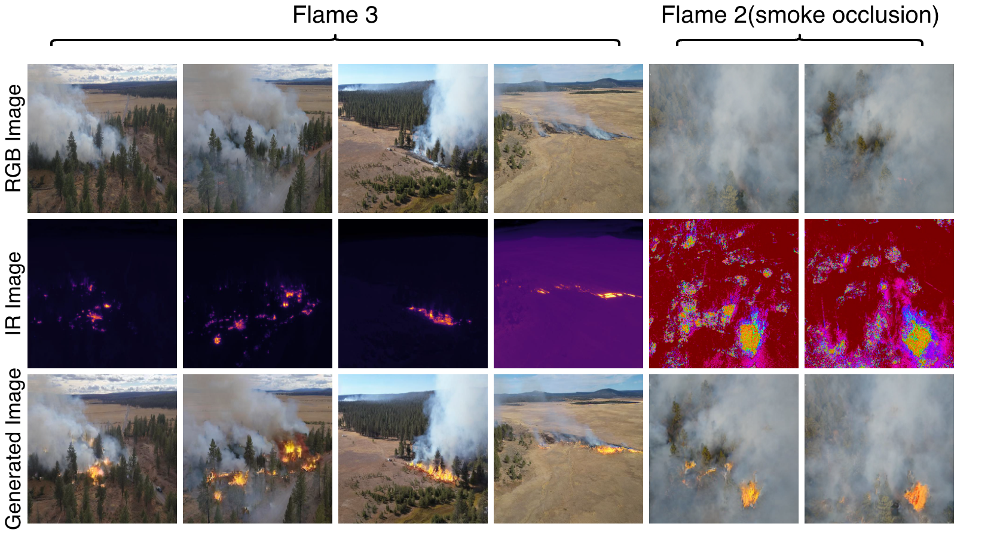

# Infrared-Guided Diffusion Models for Realistic Wildfire Image Synthesis

**Xu Cao, Pengle Cheng, and Juan Liu<sup>*</sup>**

Note: This code is associated with our manuscript 'Infrared-Guided Diffusion Models for Realistic Wildfire Image Synthesis' submitted to The Visual Computer. If you find our work helpful, please consider citing our paper.

---


## Overview of IRGDM

The following figure shows the overall motivation and comparison of the proposed IRGDM framework.

<p align="center">
  
</p>


##  Environment

This project was developed with the following environment:

- Python 3.9
- PyTorch 2.5.1
- CUDA 12.1
- diffusers
- transformers

---

## Create Conda Environment

Clone the repository:

```bash
git clone https://github.com/QCaesar0027/IRDiffusion_Wildfire.git
cd IRDiffusion_Wildfire
```

---

## Dataset

The wildfire image datasets used in this project can be downloaded from the following links.

### Download links

- **Google Drive (recommended for international access):**  

  https://drive.google.com/drive/folders/1Naj_ZDr8o8UWqxbmtQoS72Au98uMwwK6?usp=drive_link

- **Baidu Netdisk (backup mirror):**  

  https://pan.baidu.com/s/1icvJXJB4gMyk7J0AaqCziQ?pwd=jc49  

  Extraction code: `jc49`

  Description:

- **data/fire_pairs_new** – Paired wildfire images used for diffusion model training  
- **data/processed_rgb** – Processed RGB wildfire images  
- **data/thermal** – Infrared / thermal images used for guidance
---
- **mask_info_v2** - mask info


---

## Fire Detection Model

The pretrained fire detection model used for the detector-based downstream evaluation can be downloaded from the following links.

### Download links

- **Google Drive (recommended for international access):**  

  https://drive.google.com/drive/folders/1I-XTGkfQ3sHlHdYpvB5rQNcLKSS0diFS?usp=drive_link

- **Baidu Netdisk (backup mirror):**  

  https://pan.baidu.com/s/1NubC0OG3_elkGZCA04gOTQ?pwd=7xe5  

  Extraction code: `7xe5`

  Description:
The second download link contains a trained **YOLO fire detection model**:

---

##  Training

To train the infrared-guided diffusion model(LoRA fine-tuning), for example, run:

```bash
python train.py   --instance_data_dir ./data/fire_pairs_new   --output_dir ./lora_unet_output_anti_yellow_v2_16   --train_batch_size 4   --max_train_steps 9000   --learning_rate 1e-4   --lora_rank 16  --lora_alpha 32
```

---

##  Testing

To test the trained model and generate wildfire images, for example, run:

```bash
python -u test.py   --base-model runwayml/stable-diffusion-v1-5   --compare-pretrained   --batch-test-set      --output-dir comparison_results_v4_10_1_rank16_all  --guidance 10 --strength 1.0   --control-type rgb   --lora-path ./lora_unet_output_anti_yellow_v2_16/best_lora.safetensors
```
### Seed

The experiments use the default random seed specified in the code. To reproduce the reported results, please keep the default seed unchanged when running the testing script.

### Prompts and Negative Prompts

To ensure a fair comparison across different methods, all models use the same fixed positive prompt and negative prompt during inference.

**Positive prompt:**

```text

A vibrant, bright, intense wildfire with glowing orange and yellow flames, high-resolution, dramatic lighting, realistic fire textures

```


**Negative prompt:**

```text

blue, cyan, purple, green, cold colors, sky, water, violet color

```


##  Comparison experiment

To run the comparison experiments, for example, use:

```bash
python test_baseline.py \
  --batch-test-set \
  --output-dir "./images_hed_sd" \
  --base-model "runwayml/stable-diffusion-v1-5" \
  --pretrained-controlnet-id "lllyasviel/sd-controlnet-hed"
```
---

##  Evaluate

clip, fid, LPIPS, psnr .....

## Main Quantitative Results

The main quantitative comparison reported in the manuscript is shown below.

| Method | CLIP Score ↑ | CLIP Conf ↑ | CFID ↓ | PSNR ↑ | PCC ↑ | SSIM ↑ | RMSE ↓ |
|---|---:|---:|---:|---:|---:|---:|---:|
| ControlNet-Canny | 32.7238 | 0.8816 | 59.8404 | 24.4874 | 0.0342 | 0.9224 | 0.3457 |
| ControlNet-HED | 32.7634 | 0.8797 | 54.2866 | 24.9320 | 0.0060 | 0.9219 | 0.3441 |
| ControlNet-Scribble | 32.5695 | 0.8713 | 41.0988 | 24.5646 | -0.0350 | 0.9220 | 0.3538 |
| ControlNet-Lineart | 33.0531 | 0.8974 | 65.4450 | 24.4676 | 0.0464 | 0.9224 | 0.3453 |
| ControlNet-SoftEdge | 32.6116 | 0.8716 | 55.1372 | 24.8169 | -0.0171 | 0.9219 | 0.3475 |
| **IRGDM (Ours)** | **33.1271** | **0.9103** | **33.1836** | **25.8418** | **0.2713** | **0.9253** | **0.3319** |


---

##  YOLO Fire Detection Evaluation

This project uses a trained **YOLO fire detection model** to evaluate generated wildfire images.

###  Run Fire Detection

Run the detection script:

```bash
python fire_detection.py


